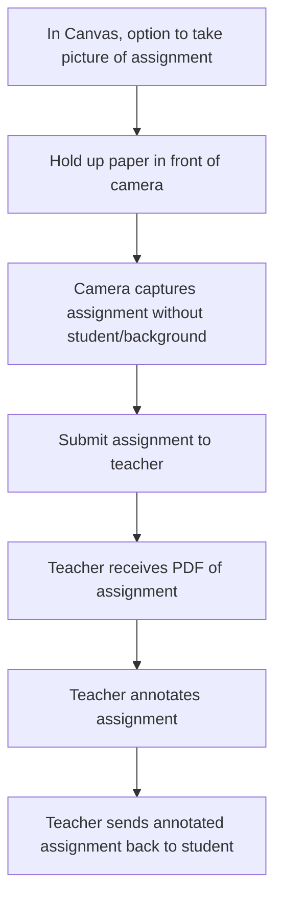

# Assignment Submission System Flowcharts

## MVP1 and MVP2 Flowcharts

```mermaid
graph TD
    %% MVP1 Student View
    subgraph MVP1
    A1[In Canvas, option to take picture of assignment]
    B1[Hold up paper in front of camera]
    C1[Camera captures assignment without student/background]
    D1[Submit assignment to teacher]
    
    %% MVP1 Teacher View
    E1[Teacher receives PDF of assignment]
    F1[Teacher annotates assignment]
    G1[Teacher sends annotated assignment back to student]
    
    A1 --> B1 --> C1 --> D1 --> E1 --> F1 --> G1
    end
    
    %% MVP2 Student View
    subgraph MVP2
    A2[In Canvas, option to take picture of assignment]
    B2[Hold up paper assignment]
    C2[Webcam captures assignment without student/background]
    D2[AI interprets student assignment]
    E2[Creates copy with handwriting converted to text]
    F2[Provides feedback before submission]
    G2[Student can repeat steps or submit]
    H2[Submit assignment to teacher]
    
    %% MVP2 Teacher View
    I2[Teacher receives PDF of assignment]
    J2[Teacher sees handwritten version and text-converted version]
    K2[Teacher sees AI suggestions for feedback]
    L2[Teacher annotates assignment]
    M2[Teacher sends annotated assignment back to student]
    
    A2 --> B2 --> C2 --> D2
    D2 --> E2
    D2 --> F2
    E2 --> G2
    F2 --> G2
    G2 --> H2 --> I2
    I2 --> J2
    I2 --> K2
    J2 --> L2
    K2 --> L2
    L2 --> M2
    end
```



## MVP1 Flowchart (Separate)



## MVP2 Flowchart (Separate)

```mermaid
graph TD
    %% MVP2 Student View
    A[In Canvas, option to take picture of assignment]
    B[Hold up paper assignment]
    C[Webcam captures assignment without student/background]
    D[AI interprets student assignment]
    E[Creates copy with handwriting converted to text]
    F[Provides feedback before submission]
    G[Student can repeat steps or submit]
    H[Submit assignment to teacher]
    
    A --> B --> C --> D
    D --> E
    D --> F
    E --> G
    F --> G
    G --> H
    
    %% MVP2 Teacher View
    I[Teacher receives PDF of assignment]
    J[Teacher sees handwritten version and text-converted version]
    K[Teacher sees AI suggestions for feedback]
    L[Teacher annotates assignment]
    M[Teacher sends annotated assignment back to student]
    
    H --> I --> J
    I --> K
    J --> L
    K --> L
    L --> M
